# 🏛️ B.H.U.M.I.

## Blockchain Hosted Unified Mutation Infrastructure


> A government-oriented hybrid Web2 + Web3 land registry platform designed to create transparent, tamper-evident, and auditable property ownership records.

```
                            BHUMI PLATFORM
                                  │
                 ┌────────────────┴────────────────┐
                 │                                 │
                 ▼                                 ▼
          👤 CITIZEN PORTAL                 🏛️ GOVERNMENT PORTAL
                 │                                 │
         ┌───────┴────────┐               ┌────────┴───────────┐
         │                │               │                    │
         ▼                ▼               ▼                    ▼
    Land Search        Registry      LOCAL AUTHORITY      GOVERNMENT HQ
    (Khasra No.)       Appointment        │                    │
         │             Booking            │                    │
         │                │               ▼                    ▼
         ▼                ▼        Document Verification   Analytics
    Verify Land       Track Status  e-KYC Verification     Reports
    Details                         Property Verification  Monitoring
         │                          Registry               Audit
         │                          Mutation               Alerts
         ▼                          Approve / Reject
    Download
    e-Registry PDF
                 │                                 │
                 └────────────────┬────────────────┘
                                  ▼
                        ┌──────────────────┐
                        │     BACKEND      │
                        │  Node + Express  │
                        └────────┬─────────┘
                                 │
                 ┌───────────────┼────────────────┐
                 │               │                │
                 ▼               ▼                ▼
            PostgreSQL     Document Storage   Payment Gateway
            Land Records       IPFS / S3
                 │               │                │
                 └───────────────┼────────────────┘
                                 ▼
                      VERIFICATION COMPLETED
                                 │
                                 ▼
                       SHA-256 DOCUMENT HASH
                                 │
                                 ▼
                       AUTHORIZED REGISTRAR
                                 │
                             ethers.js
                                 │
                                 ▼
                    ┌─────────────────────────┐
                    │     LAND REGISTRY       │
                    │     SMART CONTRACT      │
                    └────────────┬────────────┘
                                 │
                                 ▼
                            BLOCKCHAIN
                                 │
                 ┌───────────────┼───────────────┐
                 │               │               │
                 ▼               ▼               ▼
            Ownership      Document Hash     Audit Trail
             History           Proof          Timestamp
```

---

## 📌 Project Overview

**B.H.U.M.I.** is a hybrid blockchain-based digital land registry platform that connects citizens, local land authorities, government headquarters, traditional databases, secure document storage, payment systems, and blockchain infrastructure.

The primary goal is **not to replace existing government land databases**, but to introduce a blockchain-based **proof and audit layer** for verified property records. Think of the blockchain as a *digital registry book*: it holds proof of the official state, while the government database and sensitive documents stay off-chain.

B.H.U.M.I. allows:

- 👤 Citizens to search land by Khasra number, verify land details, book registry appointments and track their status
- 🏛️ Local authorities to verify documents, e-KYC and property, and to process registry and mutation
- 📊 Government HQ to monitor, audit and analyse activity across all local authorities
- 📄 Secure off-chain storage of sensitive documents
- 🔐 SHA-256 hashing of verified documents and metadata
- ⛓️ Blockchain-based ownership and audit records
- 📥 Downloadable e-Registry PDF for registered properties
- 💰 INR-based payments without requiring citizens to own cryptocurrency
- 🔄 Transparent ownership transfer history
- 🧾 Tamper-evident document verification

---

## 🎯 Problem Statement

Traditional land registry systems can face challenges such as:

- Fragmented property records
- Difficult ownership-history verification
- Document tampering concerns
- Lack of transparent audit trails
- Manual verification processes
- Complex registry and mutation workflows
- Limited central visibility into local-office activity
- Limited interoperability between systems

B.H.U.M.I. addresses these problems by combining **existing government verification systems with blockchain-based proof**.

---

## 💡 Our Solution

B.H.U.M.I. follows a **Hybrid Web2 + Web3 Architecture**.

Sensitive information stays off-chain, while blockchain stores cryptographic proofs and registry-related information.

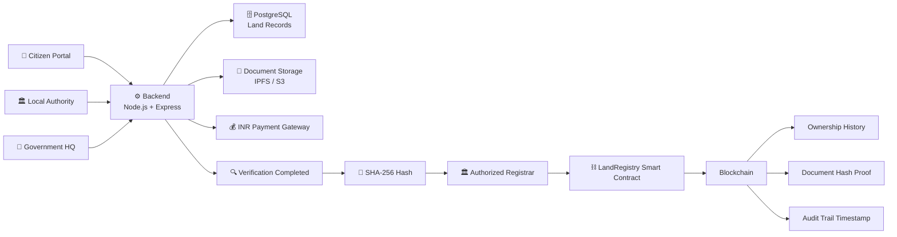

---

## 🏗️ System Architecture

The architecture is divided into six major layers:

### 1. 👤 Citizen Portal

Citizens can:

- Register/Login (OTP)
- **Search land by Khasra number**
- **Verify land details** (owner, area, land type, status, on-chain proof)
- **Book a registry appointment**
- Submit property applications and upload documents
- Make payments
- **Track application / appointment status**
- **Download the e-Registry PDF** for a registered property
- View ownership history

Citizens cannot write to the blockchain directly.

### 2. 🏛️ Government Portal

The government portal has two roles with different scopes.

#### 🏛️ Local Authority

Local officials (tehsil / sub-registrar level) can:

- Login securely
- View pending applications and appointments
- **Verify documents**
- **Perform e-KYC verification**
- **Verify property records**
- **Process registry**
- **Process mutation**
- **Approve / Reject** applications
- Initiate blockchain registration
- View blockchain transactions

#### 🏢 Government HQ

Headquarters officials can:

- View **analytics** across all local authorities
- Generate **reports**
- **Monitor** application volumes, turnaround times and pending backlogs
- **Audit** decisions and blockchain transactions
- Receive **alerts** (e.g. unusual activity, repeated rejections, stalled applications)

HQ has oversight and audit access; approval decisions remain with the local authority and authorized registrar.

### 3. ⚙️ Backend Layer

The backend acts as the central application and security layer.

Responsibilities:

- Authentication
- Authorization (role-based: Citizen / Local Authority / Government HQ / Registrar / Admin)
- Land search and record retrieval
- Appointment scheduling
- e-KYC processing
- Document validation
- Application, registry and mutation management
- Payment verification
- Hash generation
- e-Registry PDF generation
- Analytics and alert generation
- Blockchain interaction
- Audit logging

### 4. 🗄️ Off-Chain Data Layer

Stores sensitive and large data such as:

- Land records (PostgreSQL), including Khasra number
- User information
- e-KYC information
- Documents (IPFS / S3)
- Photos
- Application, appointment, registry and mutation records
- Payment records
- Audit logs

### 5. ⛓️ Blockchain Layer

Stores:

- Property ID
- Owner blockchain identity
- Document hash
- Owner photo hash
- Metadata hash
- Registration timestamp
- Transfer history
- Property status

### 6. 💰 Payment Layer

Users pay using Indian Rupees (₹) through a payment gateway.

Citizens do not need to purchase cryptocurrency or pay blockchain gas directly this is mange in backend by government .

---

## 🔎 Citizen Land Search & Verification Flow

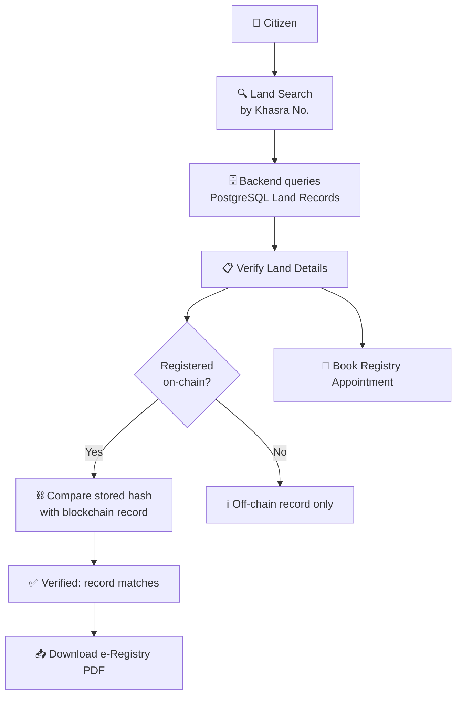

The e-Registry PDF is generated by the backend for registered properties. It carries the property details, document hash and blockchain transaction reference, so anyone can independently check it against the chain.

---

## 📅 Registry Appointment & Status Tracking

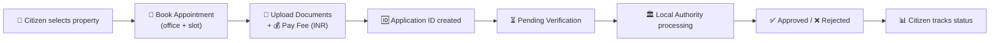

---

## 🔄 Complete Property Registration Flow

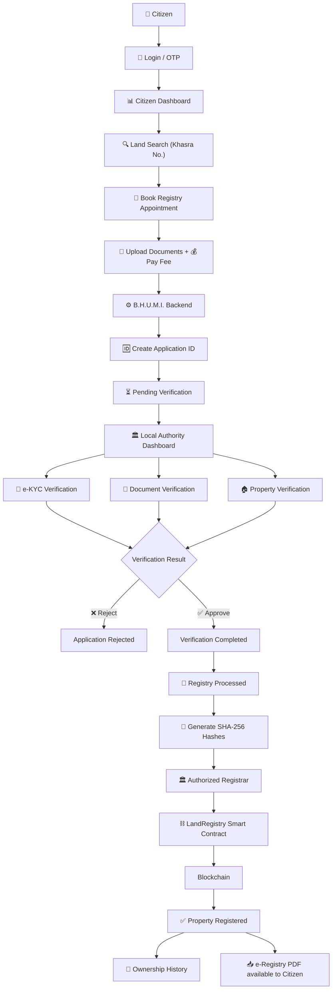

---

## 🔐 Document Verification Architecture

B.H.U.M.I. does not store complete documents directly on the blockchain.

Instead: the document remains off-chain while its cryptographic hash is recorded on-chain.

This allows an authorized system to later verify whether the document has been modified.

### 👤 Owner Photo Hash

The owner's photograph can also be represented using a cryptographic hash.

The actual photograph remains in secure off-chain storage.

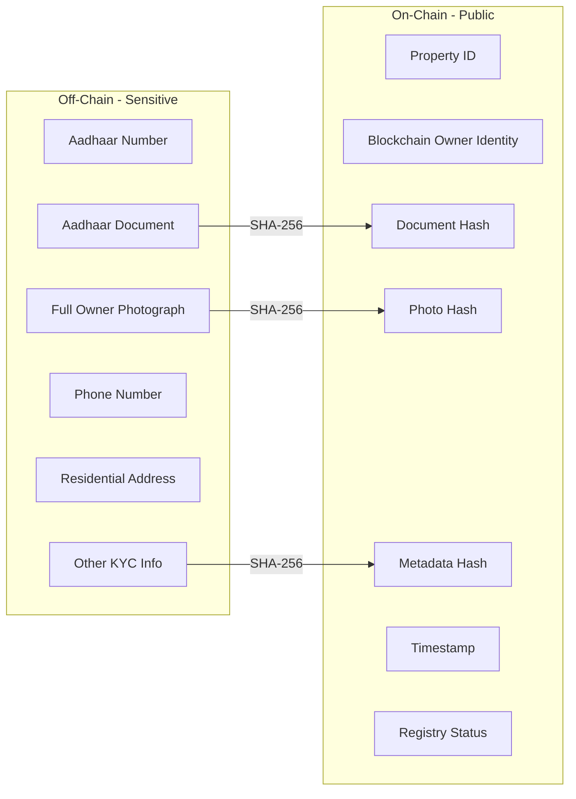

**❌ Never store directly on a public blockchain:**
- Aadhaar number
- Aadhaar document
- Full owner photograph
- Phone number
- Residential address
- Personal KYC information
- Other sensitive personal information

**✅ Store on-chain:**
- Property ID
- Blockchain owner identity
- Document hash
- Photo hash
- Metadata hash
- Timestamp
- Registry status

---

## 🧾 Smart Contract Architecture

The smart contract represents the blockchain registry state.

```solidity
struct Property {
    bytes32 propertyId;
    address currentOwner;
    bytes32 documentHash;
    bytes32 ownerPhotoHash;
    bytes32 metadataHash;
    uint256 registeredAt;
    uint256 lastTransferAt;
    PropertyStatus status;
    bool exists;
}

enum PropertyStatus {
    Pending,
    Verified,
    Active,
    Frozen,
    Disputed
}
```

---

## ⛓️ Blockchain Interaction Flow

The frontend should not directly interact with the blockchain.

Instead, B.H.U.M.I. follows a backend-first architecture.

### Core Principle

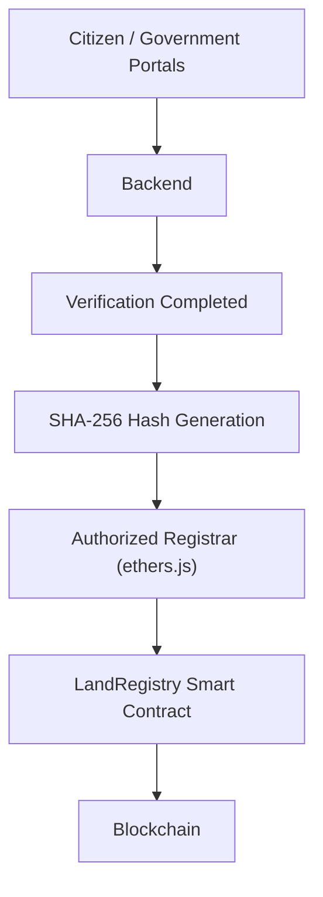

---

## 💰 INR Payment Architecture

Citizens should not have to understand cryptocurrency or blockchain gas.

The user sees a simple checkout:

> **Registry / Transfer Fee**
> ₹25,000
> **[ Pay Now ]**

not `0.004 ETH` / `[Connect Wallet]`.

The backend handles the blockchain infrastructure. The smart contract does not handle INR directly.

### ⛽ Blockchain Gas Model

Citizens should **not** be required to do this:

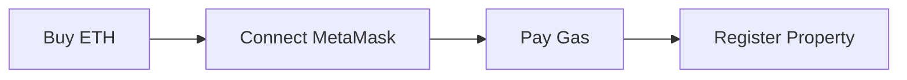

Instead, this happens behind the scenes:

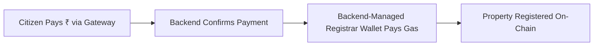

This creates a Web2-like experience for citizens while blockchain operates as the underlying infrastructure.

**Prototype setup:** deploy to an Ethereum testnet such as **Sepolia** and fund the registrar wallet with test ETH from a faucet. The registrar private key (`REGISTRAR_PRIVATE_KEY`) lives only in the backend environment / secrets manager, never in the frontend or source control.

---

## 🏛️ Local Authority Verification Workflow

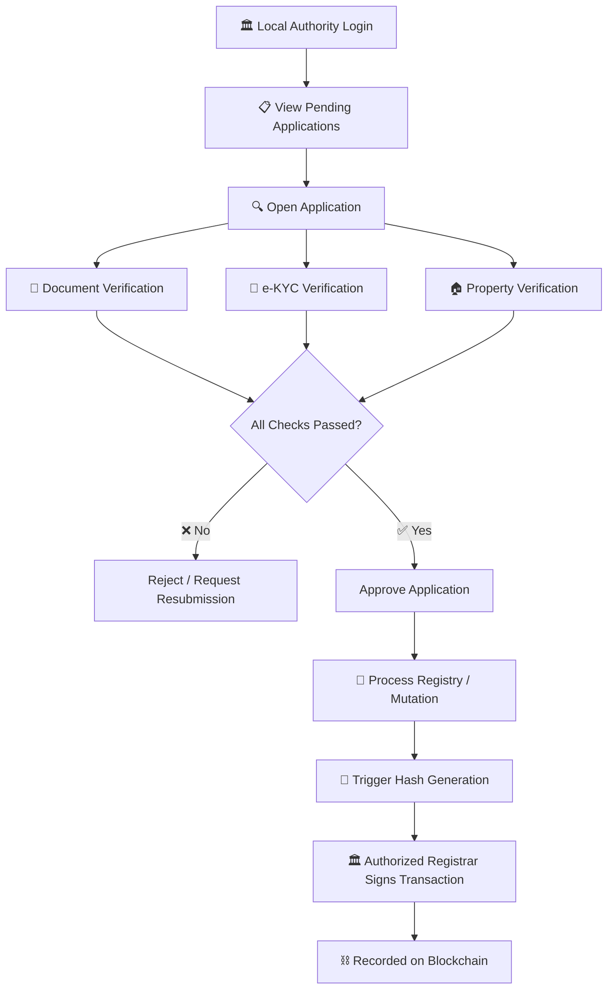

---

## 🔄 Mutation Flow

Once a property is registered, a change of ownership (sale, inheritance, gift) is handled as a **mutation** that updates both the land record and the blockchain.

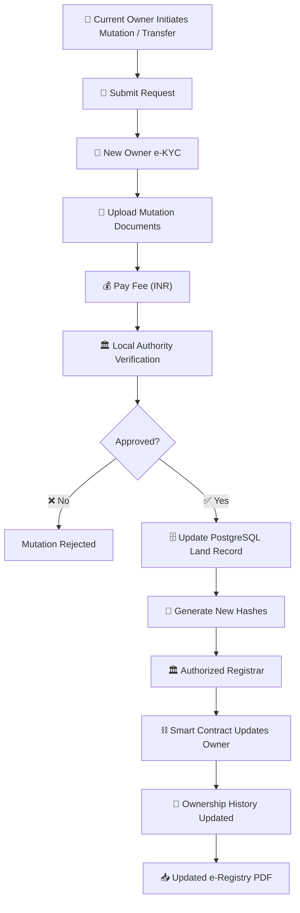

---

## 📊 Government HQ Monitoring & Audit

Government HQ does not process individual applications. It gets a read-oriented view across all local authorities.

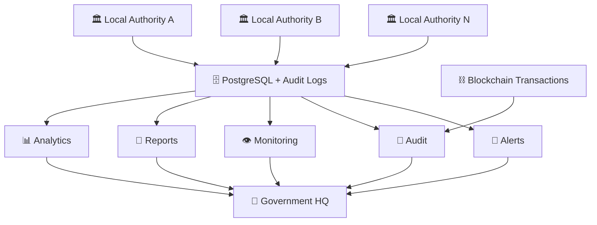

| Function | What HQ sees |
|---|---|
| Analytics | Registrations, mutations, revenue, turnaround time by office / district |
| Reports | Periodic and on-demand exports |
| Monitoring | Live pending backlog, stalled applications, office workload |
| Audit | Off-chain decisions cross-checked against on-chain transactions and timestamps |
| Alerts | Unusual patterns, repeated rejections, hash mismatches, SLA breaches |

---

## 🗃️ Data Storage Strategy

B.H.U.M.I. follows an off-chain + on-chain storage model.

| Data | Storage |
|---|---|
| User Profile | Off-chain (PostgreSQL) |
| Aadhaar / e-KYC | Secure Off-chain |
| Owner Photo | Secure Off-chain |
| Property Documents | Secure Off-chain (IPFS / S3) |
| Land Records (incl. Khasra No.) | PostgreSQL |
| Property Metadata | Off-chain |
| Payment Details | Off-chain |
| Application / Appointment Data | PostgreSQL |
| Audit Logs | PostgreSQL |
| e-Registry PDF | Generated on demand / Off-chain |
| Property ID | Blockchain |
| Owner Blockchain Address | Blockchain |
| Document Hash | Blockchain |
| Photo Hash | Blockchain |
| Metadata Hash | Blockchain |
| Registration Timestamp | Blockchain |
| Ownership History | Blockchain |

---

## 🔐 Security Model

B.H.U.M.I. follows several security principles.

**Authentication**
- JWT / secure session authentication
- OTP-based authentication
- Government official authentication

**Authorization**
- Role-based access control:
  - Citizen
  - Local Authority Official
  - Government HQ
  - Authorized Registrar
  - Admin
- Local officials are scoped to their own office / jurisdiction
- Government HQ has read and audit access across offices
- Least-privilege API access

**Blockchain Security**
- Authorized registrar wallet
- Backend-controlled transactions
- No private keys in frontend
- Secure environment variables / secrets manager
- Transaction logging
- Smart contract access control

---

## 🧩 Technology Stack

**Frontend**
- React.js
- Vite
- Tailwind CSS
- Framer Motion
- Two portals: Citizen Portal and Government Portal (Local Authority + HQ views)

**Backend**
- Node.js
- Express.js
- REST API
- JWT Authentication
- PDF generation (e-Registry)

**Database**
- PostgreSQL
- Prisma

**Blockchain**
- Solidity
- Ethereum-compatible blockchain (Sepolia testnet for the prototype)
- Hardhat / Foundry
- ethers.js

**Storage**
- IPFS
- Pinata
- Amazon S3

**Payments**
- INR Payment Gateway
- Razorpay or equivalent approved provider

**Infrastructure**
- Docker
- AWS
- CI/CD
- Secure Secrets Management

---

## 📁 Project Structure

```
BHUMI/
│
├── frontend/
│   ├── src/
│   ├── components/
│   ├── pages/
│   │   ├── citizen/        # land search, appointments, status, e-Registry
│   │   └── government/
│   │       ├── local/      # verification, registry, mutation
│   │       └── hq/         # analytics, reports, monitoring, audit, alerts
│   ├── hooks/
│   └── services/
│
├── backend/
│   ├── controllers/
│   ├── routes/
│   ├── models/
│   ├── middleware/
│   ├── services/
│   │   ├── landSearch/
│   │   ├── appointment/
│   │   ├── verification/
│   │   ├── registry/
│   │   ├── mutation/
│   │   ├── analytics/
│   │   └── blockchain/
│   └── utils/
│
├── contracts/
│   ├── src/
│   │   └── LandRegistry.sol
│   ├── script/
│   └── test/
│
├── docs/
│   └── architecture/
│
├── .env.example
├── docker-compose.yml
└── README.md
```

---

## 🔁 End-to-End Architecture

The complete B.H.U.M.I. system:

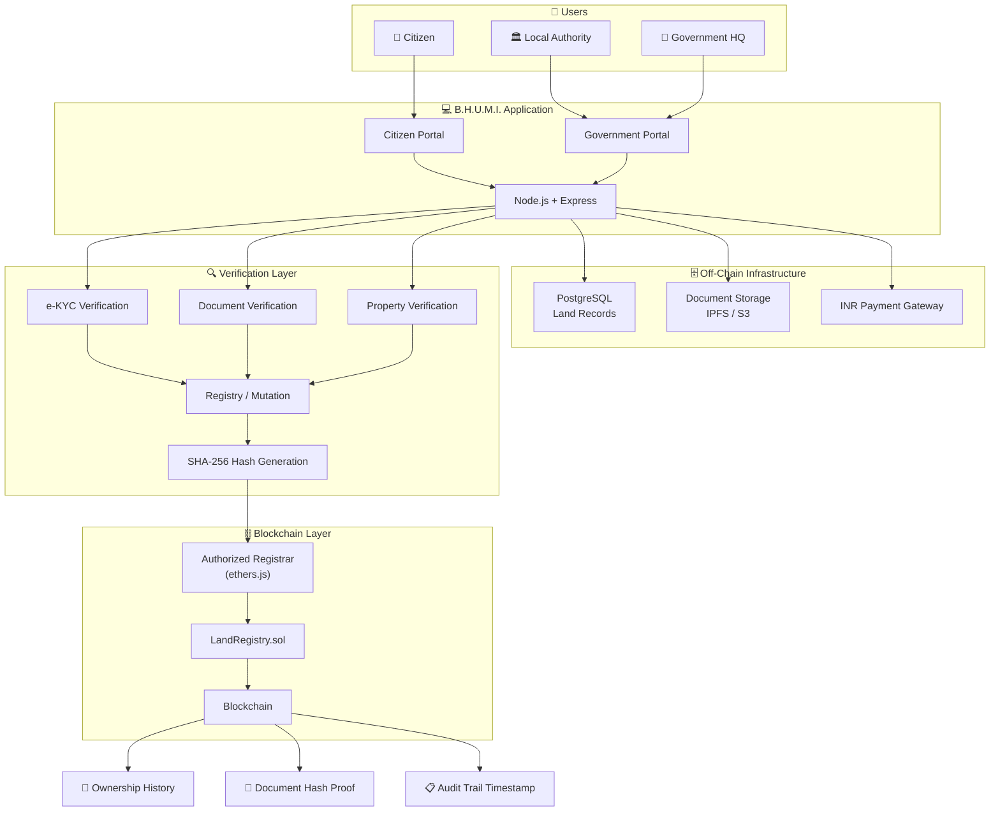

---

## 📊 Property Lifecycle

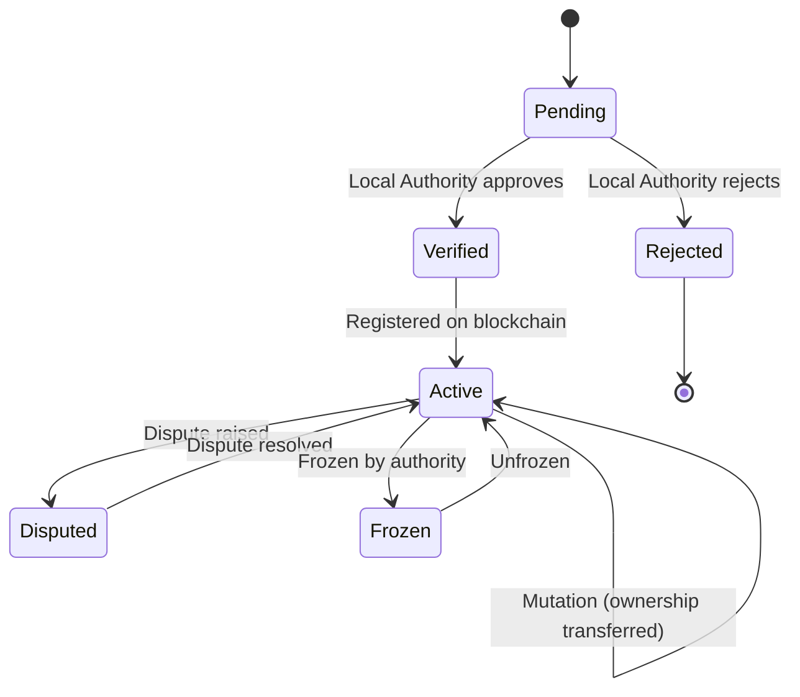

### 🆔 Example Property Record

**Off-chain database (PostgreSQL)**

```json
{
  "propertyId": "PROP-MP-BPL-001",
  "khasraNumber": "123/4",
  "district": "Bhopal",
  "tehsil": "Huzur",
  "village": "Example Village",
  "area": "1500 sq.ft",
  "landType": "Residential",
  "status": "VERIFIED"
}
```

**Blockchain record**

| Field | Value |
|---|---|
| Property ID | `PROP-MP-BPL-001` |
| Current Owner | `0x1234...ABCD` |
| Document Hash | `8e7d...a93f` |
| Owner Photo Hash | `91ab...73cd` |
| Metadata Hash | `a821...9d72` |
| Registered At | Blockchain Timestamp |
| Status | `ACTIVE` |

---

## 🧠 Why Blockchain?

B.H.U.M.I. uses blockchain specifically where it provides value.

**Traditional Database**

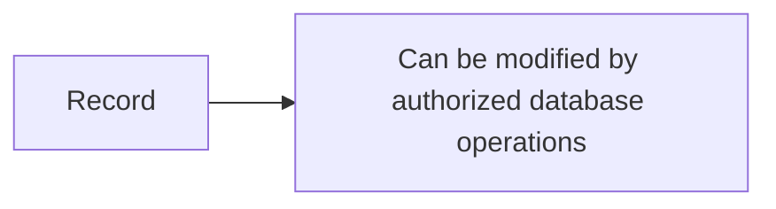

**B.H.U.M.I.**

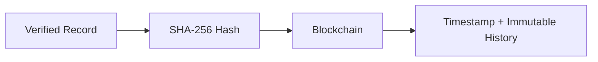

Blockchain provides:

- 🔐 Tamper-evident records
- 📜 Transparent ownership history
- ⏱️ Verifiable timestamps
- 🔍 Easier auditability
- 🤝 Shared trust between authorized stakeholders

> **Important:** Blockchain does not automatically prove that a document is legally genuine. Government/authorized verification is still required before recording the verified state.

---

## 🚀 Future Scope

B.H.U.M.I. can be extended with:

- 🗺️ GIS-based land mapping
- 🤖 AI-assisted document verification
- 🧠 OCR for land documents
- 🔎 Duplicate property detection
- 📱 Mobile application
- 🏛️ Government API integration
- 🔗 Interoperability with existing land-record systems
- 🪪 Digital identity integration
- 🔔 SMS / email notifications
- 🧾 Automated compliance checks
- 🌐 Multi-state deployment
- 🏘️ Rural citizen support

---

## 🌱 Social & Economic Impact

B.H.U.M.I. aims to improve:

**Transparency**
Citizens and authorized authorities can track the history of verified property records.

**Trust**
Cryptographic hashes provide tamper-evident proof of recorded documents.

**Efficiency**
Digital workflows can reduce manual coordination between citizens and authorities.

**Accessibility**
Citizens can interact with the platform using INR, without needing to understand cryptocurrency.

**Auditability**
Blockchain provides a verifiable transaction history, and Government HQ can monitor and audit activity across local offices.

---

## ⚠️ Important Design Considerations

B.H.U.M.I. is designed as a prototype / architectural model and would require integration with actual government systems, legal frameworks, identity infrastructure, payment providers, and data-protection requirements before production deployment.

Blockchain should be treated as a verification and audit layer, not as a replacement for legal land records.

---

## 🏆 Core Innovation

The key innovation of B.H.U.M.I. is the combination of:

```
Government Verification
        +
Secure Off-Chain Storage
        +
Cryptographic Hashing
        +
Authorized Blockchain Registration
        +
INR-Based Payments
        =
Transparent Hybrid Land Registry
```
